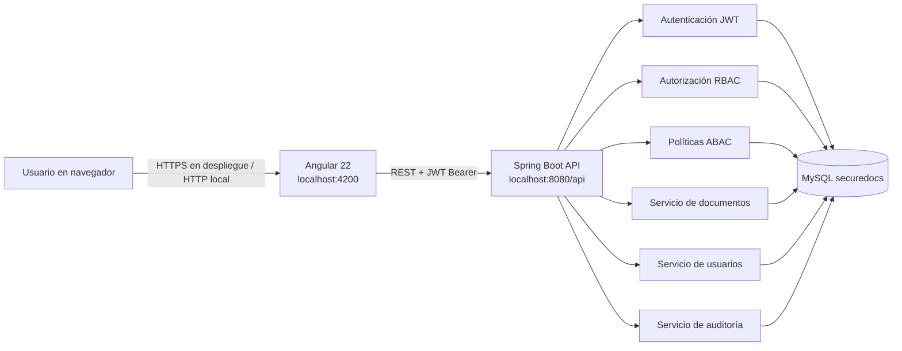

# Arquitectura de SecureDocs

## Componentes

## Flujo de autorización

1. La interfaz envía correo y contraseña a `POST /api/auth/login`.
2. Spring valida la contraseña y el estado del usuario, y devuelve un JWT.
3. La interfaz adjunta `Authorization: Bearer <token>` a solicitudes protegidas.
4. Spring obtiene al usuario autenticado, comprueba el permiso RBAC y, cuando la operación usa un documento, evalúa las políticas ABAC.
5. Las operaciones documentales que pasan por `DocumentoController` registran el resultado y motivo en auditoría.

Las reglas del backend son la autoridad para permitir o denegar. Ocultar controles en Angular es solo una ayuda de interfaz.

## Límites observados

- La interfaz usa `http://localhost:8080/api`; para otro entorno hay que cambiar la URL de API.
- El backend entrega una página de auditoría y filtros en servidor. El listado de documentos y usuarios sigue trayéndose como lista.
- La UI envía `X-Device-Type` para simular el contexto corporativo/personal en la demostración. El cliente puede falsificar ese encabezado; un despliegue real debe derivar el contexto desde una fuente de confianza.
- La autenticación no crea eventos de auditoría; los registros se generan en las operaciones de documentos.
- La configuración CORS y las credenciales de MySQL son para desarrollo local; un despliegue requiere configuración de entorno y HTTPS.
