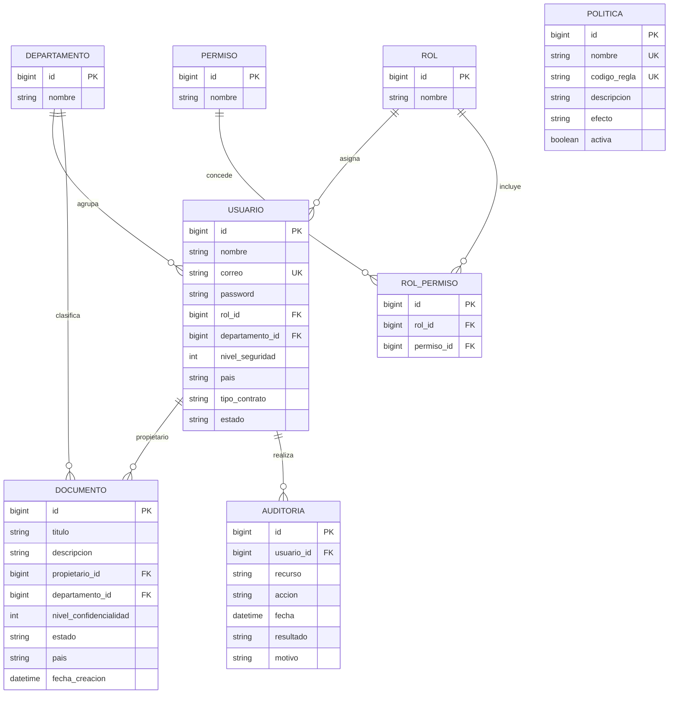

# Modelo de datos

Las entidades JPA están en `demo/src/main/java/com/Lab06/demo/entity`. Hibernate actualiza el esquema desde esas entidades con la configuración local actual. `POLITICA` es un catálogo de reglas: la implementación ABAC interpreta `codigo_regla` en `AbacService`; no almacena una expresión arbitraria.

## Relaciones

- Un usuario tiene un rol y un departamento.
- Un rol se vincula a muchos permisos mediante `ROL_PERMISO`.
- Un documento referencia al usuario propietario y a un departamento.
- Un evento de auditoría puede referenciar al usuario que realizó la operación.
- Las políticas están centralizadas como registros activables.
